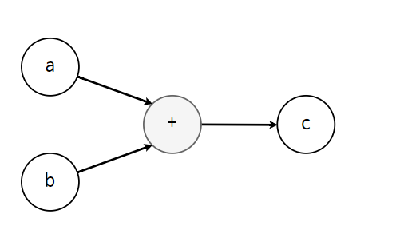

# TIL DAY 24(2022-11-07)

# AI와 ML(머신러닝), DL(딥러닝)을 알아보자

## AI

인간의 사고과정을 모방하는것이 AI.
인간의 행동과 컴퓨터의 행동을 구분하지 못하는것.

컴퓨터가 학습하는데 ML(머신러닝/기계학습), DL(딥러닝/뉴런=인간의 신경망을 참조하여 만든것)이있다.

|지도|비지도|학습|강화학습|
|:---:|:---:|:---:|:---:|
|예측(Prediction-'Linear')|군집(Clustring)|h(y)=W*x+b에서 w,b를 변경하는 일련의 과정. 고로 w,b는 '변수'이다.|보상(Reward base)을 통해 학습하는것|
|분류(Classification-logistic)| - | -|-|

ML은 
Model을 통해 데이터를 학습하고 결론을 도출하는 과정을 거치는데

    data x -> Model ->output y 정도로 볼 수 있다.

지도/비지도의 차이점?

지도는 y값을 우리가 알려주고
비지도는 y값을 알려주지않고 x만 준채 알아서 판단하게 시키는것

>EX)개와 고양이 사진을 주고 사용자가 라벨링 = 지도 | 라벨링 지정X = 비지도/
EX2)feature들만 있는데 분류하고 싶다 -> 비지도 학습 (군집)
feature와 label이 있다 -> 지도학습


## ML 순서

1. 데이터준비
2. 데이터 분할 : train,test set으로 일단 분리하고, training sets, validation sets (각각 학습용, 검증용이고 '여러번'평가한다.), 마지막으로 test sets:모델의 성능을 평가(한번!)

3. 준비 :예측,군집,분류를 정함 (=model=LogisticRegression() logsitic이니까 논리값,불연속 데이터) 즉, 이부분은 MODEL을 정해주는 단계. 어떤모델을 쓸까?
4. 학습 : optimizer(최적화함수) / train(optimizer가 어떻게 움직일지) / loss(오차값,0으로갈수록 오차↓) 지정
5. 예측 OR 평가 : 재현,정밀도,정확도(모델검증)을 하는 단계. 


EX1)
찾는값(x) 목표값(y)로 많이쓰므로 y.target주로 이용

train_x,test_x,train_y,test_y = train_test_split(x,y,test_size=0.3, random_state=1) < 데이터를 분할하는 과정이다. 

|제목|내용|
|:----:|:---:|
|train_test_split|파라미터가 test_szie,random_state두개가있다. 실질적으로train set과 test set으로 분할해줌.|
|test_size|전체 데이터에서 테스트 데이터의 사이즈 지정 0.3이면 30%(test set이 30임. 나머지 70은 train sets)|
|random_state|어떤값이오든 상관x. 호출할때마다 동일한 학습,테스트용 데이터 세트 생성용이므로 어떤값이오든 기능은 동일|

EX2)

loss=tf.reduce_mean(tf.square(h-y))
optimizer= tf.train.GradientDescentOptimizer(0.01)
train = optimizer.minimize(loss)

optimizer+train을 한줄로 쓸 수 있다. 여기서 0.01은 learningrate.

learningrate가 너무크면 OverShooting 되어버려 그래프 밖으로 나가버리게 되어 NaN이 뜨고, 너무작으면 값을줄이는데 많이반복해서 학습이 느리므로 비효율적.
(왼쪽으로 갈수록 오차률이 적어지고, 기울기 * 0.01 (learningrate)해서 경사를 깎는다.)

Gradient Descent = 경사깎는 알고리즘 기법. 주로 최저값을 찾아내는데 많이사용.

>train=tf.train.GradientDescentOptimizer(0.01).minimize(loss)

|제목|내용|
|:----:|:---:|
|Optimizer|loss의 오차률을 깎는과정 (더 정확히 말하면, loss가 작아지도록 w와 b를 조정)|
|Train|optimizer가 어떻게 행동할건지 위에선 loss가 minimize , 최저에가깝도록|
|loss|구할값의 오차률 |

### 정리하자면, Gradient Descent, loss,optimizer,train 이렇게는 한 셋트이고, x의값이 선형(시간,돈, 등 연속되는데이터),논리(성별 등 연속되지않는데이터)에 따라 저부분이 조금씩 바뀐다 (선형은 h-y 차이 제곱해서 mean쓰면되고 논리는 softmax나 sigmoid + cross_entropy)

EX3)

3끝~5의단계 핵심

sess=tf.Session()
sess.run(tf.global_variables_initializer()) <이 코드는 초기화한다. 이쪽이 3끝. 

epochs=10000
for step in range(epochs):
    _,loss_val,w_val,b_val=sess.run([train,loss, w, b], feed_dict={x:data_x, y:data_y })
    if step % 500 == 0:
        print(f'w{w_val} \t b:{b_val} \t loss:{loss_val}') 4부분

print(f'4시간 공부 + 2시간 과외 : {"pass" if (sess.run(h, feed_dict={x: [[4,2]]})) >0.5 else "fail"}') 5부분이라고 생각할수있음.


|제목|내용|
|:----:|:---:|
|Session|변수=tf.Session tensorflow에선 Session이 실제 실행을담당|
|epochs|학습을 반복할 횟수. for step in range(10000) 처럼 바로적어도 된다.|
|feed_dict|dict타입으로 준다. (위에선 무엇을? x 와 y값을)|

EX4)

예측,분류,군집,loss를 조금 더 세세하게 알아보자
regression:회귀. 예측변수라 불리는 특성(Feature)을 이용해 최종적인 결과를 예측. 이걸 회귀라고부름.


|제목|내용|종류|
|:----:|:---:|:---:|
|예측(Prediction)=**Linear regression**|연속적데이터=수치계산, 데이터들을 가장 잘 표현할수있는 '선'생성->입력에 대한 예측!|-|
|분류(Classification),logistic regression|전형적 지도학습. 불연속적인 데이터=확률계산,binary classification T/F,multi-lable classification=a,b,c,d 등등|KNN:A와B사이에 임의의값을주고 임의값에서 가장가까운K개를비교.K는 일반적으로홀수</br>SVM: Hard,Soft Margin으로 나뉨 하드는 오버피팅(이상치허용x),소프트는 이상치허용(언더피팅). Kernel Trick:차원을 추가하여 분류</br>Decsion Tree:스무고개. 질문에대한 답(T/F)를 반복하여 분류한다.</br>Random Forest:여러개의 Decision Tree를연결(앙상블)한것. 0.9이하의 낮은친구들을 어떻게 쓸까?에서 나옴|
|군집(Clustering)|비지도학습.레이블이필요하지않음!|k-mean:k개의 중심을 랜덤으로 지정하여 중심별로 군집화시킴.변경되는 데이터가없을때까지 실행=각 데이터의</br>그룹과 중심의 거리차이의 분산을 최소화시킴|
|loss|오차를구하는것|MSE(Mean Squared Eroor):h-y해서 제곱하여 비교. 가장많이씀</br> MAE(Mean Abslute Error) h와 y의 차이를 절대값으로 비교|

EX5)

data_x =[[73,80,75],[93,88,93],[89,91,90],[96,89,100],[73,66,70]]

data_y=[[80],[91],[88],[94],[61]] #x값에대한 라벨개념 [73,80,75]=[80]..이런식으로 매핑

x=tf.placeholder(shape=[None,3], dtype=tf.float32) [로우갯수,컬럼갯수]

y=tf.placeholder(shape=[None,1], dtype=tf.float32)  Y는[80]처럼 컬럼이1개니까1

w=tf.Variable(tf.random_normal([3,1]),name='weight') [인풋갯수,아웃풋갯수]3개1개
b=tf.Variable(tf.random_normal([1]),name='bias') 1개


## DL(딥러닝)
DL은 AI가 복잡한 처리를 할 수 있게 도와준다.
가장 큰 특징으로는 사람의 신경망을 모방한 구조를 가지고있다.(자극(X)가 주어지면 반응(OUTPUT)) 

Depp Neural Network (tneserflow에서 nn)
Multi-Layer Perceptorn

인풋 레이어 / 히든 레이어 / 아웃풋 레이어 크게 세가지로 이루어져있는데
**레이어가 많다고해서 정확도가 높아지는건 아님**
XOR처리할때 자주이용

기본적으로 y=f(x1 * w1 + x2 * w2 + b)의 구조를 가지고있다. 
아웃풋y가 한개이므로 tf.Variable(tf.random_normal([1]))이다.


## Sklearn & TensorFlow 라이브러리의 특징

### Sklearn
추상화가 정말 잘되어있는 파이썬 라이브러리이다.내부동작을 알수없는게 단점이지만 사용하기는 정말 편함


위와같이 graphviz tree도 그릴수있다.(별도의 설치가 필요함)
Sklearn의 동작 내부는 알수없지만 저렇게 그래프로 그리면 조금이나마 알 수있다.

### Tensorflow
텐서의 흐름(Flow)를 그린다.
ver1 / ver2 가 존재. 1보다 2가 사용하기 편하다고함.

Sklearn보다 사용하기어렵지만 구조를 알아보고  만들 수 있는게 많음
다만 텐서플로우는 세션(Session)을 통해 실제로 그린 그래프를 '실행'시킨다.

그래프를 정의(흐름(수식임!)을 정의) -> Session으로 실행(sess = tf.Session(), sess.run(실행할변수))




위와 같은 구조를 정의하는게 Tensorflow 가장 큰 특징.


<details>
<summary>Sklearn,teserflow구조</summary>


```python

from sklearn.model_selection import train_test_split
from sklearn.linear_model import LogisticRegression #논리적으로 n개중에 1개 선택할때 씀. 연속적 데이터 x
import numpy as np

#데이터를 1차원으로 던져주면 알아서 예측하고 학습하는친구 sklearn
# 파이썬 프로그래밍 언어용 자유 소프트웨어 기계 학습 라이브러리이다
#1.데이터 준비
#공부시간,과외시간->시험에pass[1]/fail[0]
x=[
    [1,0],
    [2,0],
    [5,1],
    [2,3],
    [3,3],
    [8,1],
    [10,0]
]

y=[
    [0],
    [0],
    [0],
    [0],
    [1],
    [1],
    [1]
]

#2
train_x,test_x,train_y,test_y = train_test_split(x,y,test_size=0.3, random_state=1)

#3
model=LogisticRegression()

#4

model.fit(train_x,train_y,np.ravel(train_y))

#5
pred=model. predict(test_x)

for i in range(len(test_x)):
    print(f'{test_x[i][0]} 시간 공부하고, {test_x[i][1]} 시간 과외받으면 : {"pass"if pred[i] == 1 else "fail"}')

from sklearn.datasets import load_iris
from sklearn.model_selection import train_test_split
from sklearn.tree import DecisionTreeClassifier


#sklearn은 상황에 따라 모델만 바꿔서 실행할수있다는 장점이있다.

#1
iris=load_iris()
x=iris.data
y=iris.target

#2

train_x,test_x,train_y,test_y = train_test_split(x,y, test_size=0.3, random_state=1)
#3

model=DecisionTreeClassifier()
#4
model.fit(train_x,train_y)

#5
pred=model.predict(test_x)
for i in range(len(test_x)):
    print(f'{test_x[i]} 예측 :{iris.target_names[pred[i]]}/ 실제 :{iris.target_names[test_y[i]]}')

from sklearn.datasets import load_iris
from sklearn.model_selection import train_test_split
from sklearn.cluster import KMeans
import pandas as pd
import matplotlib.pyplot as plt

#1 트리그리기

iris=load_iris()
x=iris.data
y=iris.target


#2
trian_x,test_x,train_y,test_y=train_test_split(x,y, test_size=0.3, random_state=1)

#3

model=KMeans(n_clusters=3) #우리가 분류시키길원하는 갯수. 3인이유는 우리가 분류할 아이리스의 ..회사갯수? 분류할 갯수가 3개라서

#4
model.fit(trian_x)
#5
pred=model.predict(test_x)
for i in range(len(test_x)):
    print(f'{test_x[i]} 예측 :{iris.target_names[pred[i]]}/ 실제 :{iris.target_names[test_y[i]]}')


# 어떻게 군집되었는지 그래프! *표시가 그 군집의 센터이다. 4차원으로 그려져야하지만 되지않음

df=pd.DataFrame(test_x)
df.columns=['sepal_length','sepal_width','petal_length','petal_width']
df['category']=pd.DataFrame(pred)

centers=pd.DataFrame(model.cluster_centers_)
centers.columns=['sepal_length','sepal_width','petal_length','petal_width']
center_x=centers['sepal_length']
center_y=centers['sepal_width']

plt.scatter(df['sepal_length'],df['sepal_width'], c=df['category'])
plt.scatter(center_x,center_y,s=100,c='r',marker='*')
plt.show()


from sklearn.datasets import load_iris
from sklearn.model_selection import train_test_split
from sklearn.neural_network import MLPClassifier


#1
iris=load_iris()
x=iris.data
y=iris.target

#2
train_x,test_x,train_y,test_y=train_test_split(x,y, test_size=0.3, random_state=1)

#3
model=MLPClassifier(hidden_layer_sizes=1) #히든레이어를 생성한다.뉴럴신경망비슷한걸 내부적으로 그림


#4
model.fit(train_x,train_y)

#5
pred=model.predict(test_x)
for i in range(len(test_x)):
    print(f'{test_x[i]} 예측 :{iris.target_names[pred[i]]}/ 실제 :{iris.target_names[test_y[i]]}')


#tensorflow.
import tensorflow as tf

#print(tf.__version__)


#상수노드
node =tf.constant(100)
#그래프 실행시켜주는 역할(runner)
sess=tf.Session() #tf.compat.v1.session 을 사용 저건 없어진거
#노드실행
print(sess.run(node))

'''
Tensor:데이터 저장 객체(placeholder)
Variable: y = w * x * b의 w와 b가 변수역할을한다
Operation : H= w * x * b(수식) -> graph 텐서플로우에선 그래프라고한다
graph: tensor ->operation -> tensor -> operation ...
Session : 실행환경(학습)

'''

import tensorflow.compat.v1 as tf

#np.float32==tf.float32
node1=tf.constant(10,dtype=tf.float32)
node2=tf.constant(20,dtype=tf.float32)

node3=node1 + node2 #node1+node2 해서 node3이되도록했다.

sess=tf.Session() #~.tf.compat.v1.Session() | tf.compat.v1.Session() 라고적어도됨. 지금은 import로 했기때문에 .Session()만씀
print(sess.run(node3))

#node1과 node3을 같이실행해서 확인하고싶음
print(sess.run([node1,node3])) #!!리스트형태로 넣어줘야함!! 아니면 오류!

#03
import tensorflow.compat.v1 as tf


#placecholder:그래프를 실행하는 시점에 데이터 입력받아서 실행

node1 =tf.placeholder(dtype=tf.float32)
node2=tf.placeholder(dtype=tf.float32)
node3=node1+node2
sess=tf.Session()

x= [10,20,30]
y=[40,50,60]

#dict형태로 feed를줘라 node1에는 x의값을 node2에는 y의값을
print(sess.run(node3,feed_dict={node1:x,node2:y}))

#05 리니어

import tensorflow as tf

#04는 x가 한개 05번은 x를 3개넣을거임
#1.
#3번의 쪽지시험 결과를 가지고 실제 시험 점수를 예측하고 싶다.

data_x =[[73,80,75],[93,88,93],[89,91,90],[96,89,100],[73,66,70]]

data_y=[[80],[91],[88],[94],[61]] #x값에대한 라벨개념 [73,80,75]=[80]..이런식으로 매핑

x=tf.placeholder(shape=[None,3], dtype=tf.float32) #컬럼은 3개 None=rows갯수. 몇개들어올지몰라서 None로 지정
y=tf.placeholder(shape=[None,1], dtype=tf.float32) #컬럼은무조건 1개 . row는 몇줄이 들어와도 상관x

#2 가설성정

w=tf.Variable(tf.random_normal([3,1]),name='weight') #행렬곱이 일어나야하기때문에 갯수를 맞춰줘야한다
b=tf.Variable(tf.random_normal([1]),name='bias')

h=tf.matmul(x,w)+b #x가 여러개니까

#3
loss=tf.reduce_mean(tf.square(h-y))

learning_rate=0.00004 #0.00001 로 하면 오차률이 12까지 올라감( 오차가 크다는소리)
optimizer =tf.train.GradientDescentOptimizer(learning_rate) #=tf.train.GradientDescentOptimizer(0.00004)
train=optimizer.minimize(loss)

sess=tf.Session()
sess.run(tf.global_variables_initializer())

#4
epochs=50000 #50000번을 0.00004간격으로 학습.

for step in range(epochs):
    _,loss_val,w_val,b_val =sess.run([train,loss, w, b ], feed_dict={x: data_x, y:data_y})
    if step % 1000 == 0 : #1000번 학습할때마다 print를 찍음
        print(f'w:{w_val} \t b : {b_val} \t loss : {loss_val}')

#5
print(sess.run(h,feed_dict={x : [[100,80,87]]}))


#06번

import tensorflow as tf

#1.데이터 준비
#공부시간,과외시간->시험에pass[1]/fail[0]
#x1,x2 = 공부시간,과외시간. y= t/r로나올거니까 sigmoid를 사용해야한다. x * w +b -> sigmoid - >h-y 이 과정을거치는데
#sigmoid로나온 결과는 논리값이므로 cross entropy를 사용(이게 loss의 역할을 한다)

data_x=[
    [1,0],
    [2,0],
    [5,1],
    [2,3],
    [3,3],
    [8,1],
    [10,0]
]

data_y=[
    [0],
    [0],
    [0],
    [0],
    [1],
    [1],
    [1]
]

x=tf.placeholder(shape=[None,2], dtype=tf.float32)
y=tf.placeholder(shape=[None,1], dtype=tf.float32)

#2

w= tf.Variable(tf.random_normal([2,1]),name='weight')
b= tf.Variable(tf.random_normal([1]),name='bias')

logit=tf.matmul(x,w)+b
#sigmoid : 0~1사이의 실수 (h>0.5:True)
h= tf.sigmoid(logit) #logit해서 sigmoid해서 g를만듦

#3
#sigmoid를 쓰려면 꼭 sigmoid_cross_entropy~와 같이써야함
loss=tf.reduce_mean(tf.nn.sigmoid_cross_entropy_with_logits(logits=logit,labels=y)) #nn=뉴트로 네트워크

learning_rate=0.1
optimizer =tf.train.GradientDescentOptimizer(learning_rate)
train=optimizer.minimize(loss)


sess=tf.Session()
sess.run(tf.global_variables_initializer())

#4
epochs=10000
for step in range(epochs):
    _,loss_val,w_val,b_val=sess.run([train,loss, w, b], feed_dict={x:data_x, y:data_y })
    if step % 500 == 0:
        print(f'w{w_val} \t b:{b_val} \t loss:{loss_val}')

#5 예측

print(f'4시간 공부 + 2시간 과외 : {"pass" if (sess.run(h, feed_dict={x: [[4,2]]})) >0.5 else "fail"}')

#07번!
import tensorflow as tf

#06번은 이항분류 (바이너리)
#07번은 멀티
#1

data_x = [
    [10, 7, 8, 5],
    [8, 8, 9, 4],
    [7, 8, 2, 3],
    [6, 3, 9, 3],
    [7, 5, 7, 4],
    [3, 5, 6, 2],
    [2, 4, 3, 1]
]
#상 / 중 / 하 로 나눌것임 2개면 0,1로 나타내면되지만
#3개는 라벨링해줘야한다. one hot encoding
#상 중 하
#[상은 100
# 중은 010
# 하는 101 ] 이런식으로
data_y = [ #이친구는 지금 논리적인값. 연속되는값이아님
    [1, 0, 0],
    [1, 0, 0],
    [0, 1, 0],
    [0, 1, 0],
    [0, 1, 0],
    [0, 0, 1],
    [0, 0, 1]
]

x=tf.placeholder(shape=[None,4],dtype=tf.float32)
y=tf.placeholder(shape=[None,3],dtype=tf.float32)

#2

w=tf.Variable(tf.random_normal([4,3])) #x랑곱할거니까 앞은 4. 분류는 상중하로 할거니까 3.  결과가 나오는게3개
b=tf.Variable(tf.random_normal([3])) #얘는 그냥 상수이므로 3. input 4개 output 3개

logits=tf.matmul(x,w) +b
h=tf.nn.softmax(logits) #softmax=다 더하면 1이되게하는친구

#3 cross_entropy 와 논리적인값은 친구. cross_entropy가있으면 어딘간 논리값이다(논리값이기에 logits라고썼고)
loss =tf.reduce_mean(tf.nn.softmax_cross_entropy_with_logits_v2(logits=logits,labels=y))
#선형적인값(논리값x 연속되는값)= tf.reduce_mean(tf.square(h-y))/ 뭐가 논리고 선형? 시간,돈=선형 | 성별=논리
train=tf.train.GradientDescentOptimizer(0.01).minimize(loss) #train+optimizer를 한줄로
#초기화
sess=tf.Session()
sess.run(tf.global_variables_initializer())
#4
for step in range(3000) : #3000=epochs
    _,loss_val,w_val,b_val =sess.run([train, loss ,w ,b], feed_dict={x:data_x , y:data_y})
    if step % 300 ==0:
        print(f'w:{w_val}\t b:{b_val} \t loss:{loss_val}')

#5
print(sess.run(h, feed_dict={x : [[3,9,9,9]]}))
#상 일확률: 중 일확률: 하 일확률:


#DL XOR (ML로는 제대로된값이 나오지않음)

#DL(딥러닝)으로 xor를 해결해보자
import tensorflow as tf

#1
data_x=[
    [0,1],
    [0,1],
    [1,0],
    [1,1]
]
data_y=[
    [0],
    [1],
    [1],
    [0]
]
#같으면 0 틀리면1

x=tf.placeholder(shape=[None,2],dtype=tf.float32)
y=tf.placeholder(shape=[None,1],dtype=tf.float32)


#2 딥러닝은 입력과 출력사이에 레이어가 있다.(서로 연결되어있는)

#입력층
w1=tf.Variable(tf.random_normal([2,10])) #w1라는 레이어는 동그라미.. ㅇ-<ㅇㅇ 이런게 10개가있다
b1=tf.Variable(tf.random_normal([10])) #w1가 10개니까 10개
layer1 =tf.sigmoid(tf.matmul(x,w1)+b1)

#히든층

w2=tf.Variable(tf.random_normal([10,20])) #얘는 20개
b2=tf.Variable(tf.random_normal([20]))
layer2=tf.sigmoid(tf.matmul(layer1,w2) + b2) #이번엔 x가아니라 layer1의 출력되는값을 받아와서 곱하고 더해서 layer2를 만듦


w3=tf.Variable(tf.random_normal([20,10])) #다시 10로 줄입
b3=tf.Variable(tf.random_normal([10]))
layer3=tf.sigmoid(tf.matmul(layer2,w3)+b3)

#출력층

w4=tf.Variable(tf.random_normal([10,1])) #출력은 한개
b4=tf.Variable(tf.random_normal([1]))

logit=tf.matmul(layer3,w4) +b4
h=tf.sigmoid(logit)

#3
loss=tf.reduce_mean(tf.nn.sigmoid_cross_entropy_with_logits(logits=logit, labels=y))

train=tf.train.GradientDescentOptimizer(learning_rate=0.1).minimize(loss)

sess=tf.Session()
sess.run(tf.global_variables_initializer()) #초기화,작성해야 loss,w등 확인
#4
for i in range(10000):
    _,loss_val=sess.run([train,loss], feed_dict={x:data_x,y:data_y})
    if i % 1000 == 0:
        print(f'loss:{loss_val}')

#5
print(sess.run(h,feed_dict={x:data_x}))


```
</details>


